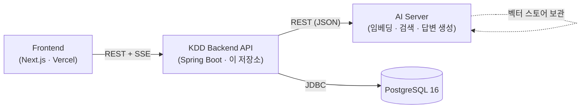
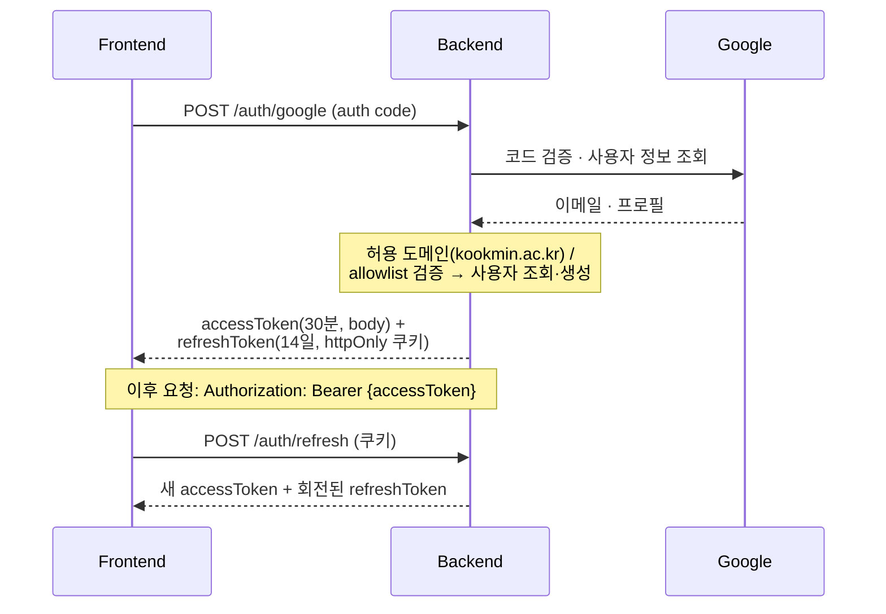
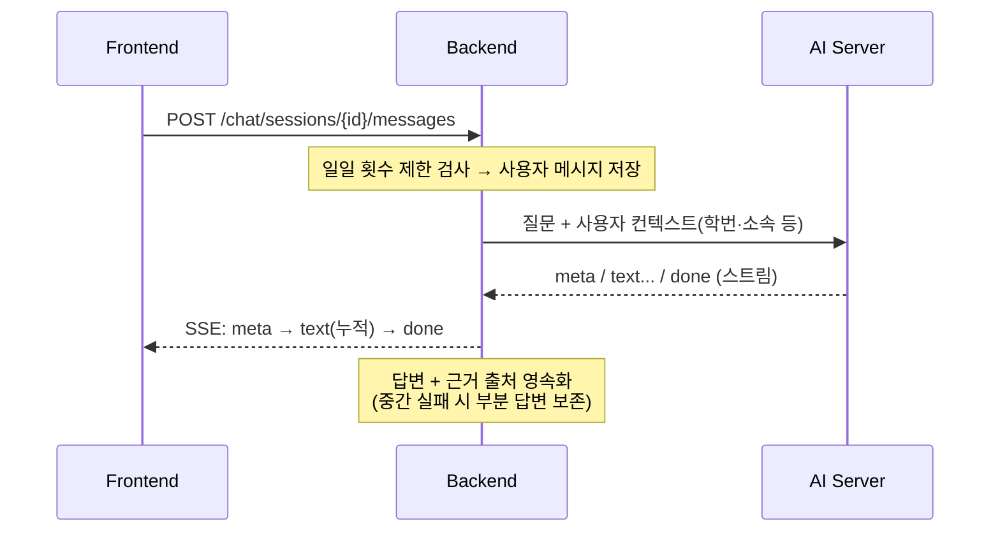

<div align="center">

# KDD Backend API

**Kookmin Digital Doc** — 국민대학교 학칙·학사규정 RAG 챗봇 백엔드

학생·교직원이 학칙과 학사규정을 자연어로 질문하면, 업로드된 규정 문서를 근거로
**출처와 함께** 답변하는 RAG(Retrieval-Augmented Generation) 챗봇의 백엔드 API 서버입니다.


</div>

문서 적재·검색·답변 생성 등 AI 연산은 **별도 AI 서버**가 담당하며, 본 서버는 인증·문서 관리·채팅 세션·FAQ·통계 등 도메인 로직과 AI 서버 오케스트레이션을 책임집니다.

---

## 프로젝트 정보

| 항목 | 내용 |
|------|------|
| 기간 | 2026.03.06 ~ 2026.06.15 (국민대 알파프로젝트, 1학기) |
| 구성 | Backend(API) · Frontend(Web) · AI 서버로 구성된 멀티 레포 프로젝트 |
| 백엔드 | 장민주, 이상진 |
| 저장소 | [KDD 조직](https://github.com/KDD-Kookmin-Digital-Doc) — `api`(이 저장소) · `web` · `ai` |

> 본 저장소는 전체 시스템 중 **백엔드 API 서버**입니다.

### 역할 분담

| 담당 | 주요 영역 |
|------|-----------|
| **장민주** | 인증(Google OAuth · JWT) · 사용자 프로필 · 채팅 세션/메시지(SSE) · 사용자/채팅 한도 관리(Admin) |
| **이상진** | 문서 업로드·파싱·검색 · FAQ · FAQ 후보 검수 파이프라인 · 통계(Admin) |

---

## 목차

- [시스템 아키텍처](#시스템-아키텍처)
- [기술 스택](#기술-스택)
- [프로젝트 구조](#프로젝트-구조)
- [도메인 구성](#도메인-구성)
- [주요 동작 흐름](#주요-동작-흐름)
- [API 엔드포인트](#api-엔드포인트)
- [데이터베이스](#데이터베이스)
- [빠른 시작 (로컬)](#빠른-시작-로컬)
- [빌드 & 검증](#빌드--검증)
- [배포](#배포)
- [API 문서](#api-문서)
- [라이선스](#라이선스)

---

## 시스템 아키텍처



- **Frontend ↔ Backend** — REST API + 채팅 답변은 **SSE(Server-Sent Events)** 스트리밍
- **Backend ↔ AI Server** — 문서 청크 임베딩(`embed`)·삭제(`delete`)·FAQ 클러스터링(`analyze`)·채팅 답변 스트리밍을 REST로 위임
- **Backend ↔ DB** — 사용자·문서·청크·채팅·FAQ 메타데이터를 PostgreSQL에 영속화 (임베딩 벡터는 AI 서버가 보관)

## 기술 스택

| 분류 | 기술 |
|------|------|
| Language / Runtime | Java 17 |
| Framework | Spring Boot 3.4.3 (Web MVC · Data JPA · Security · Validation · WebFlux) |
| Database | PostgreSQL 16 |
| Migration | Flyway |
| Auth | Google OAuth 2.0 + JWT (jjwt), Caffeine 세션 캐시 |
| Scheduling | Spring Quartz |
| Document Parsing | Apache PDFBox(PDF), Jsoup · Playwright(HTML/크롤링) |
| API Docs | springdoc-openapi (Swagger UI) |
| Build / Deploy | Gradle, Docker, docker-compose |

## 프로젝트 구조

도메인별 패키지로 분리되어 있으며, 각 도메인은 `controller / service / repository / entity / dto`로 구성됩니다.

```
src/main/java/com/kdd
├── KddApplication.java     # 진입점
├── auth/                   # Google OAuth · JWT 발급/재발급 · 세션
├── chat/                   # 채팅 세션 · 메시지 SSE 스트리밍 · 횟수 제한
├── document/               # 문서 업로드 · 파싱 · 청킹 · 조회/검색
├── faq/                    # FAQ CRUD · AI 자동 후보 검수
├── user/                   # 학생/교직원 프로필 · 사용량 관리
├── setting/                # 전역 설정(기본 채팅 한도 등)
├── statistics/             # 관리자 사용 통계
├── ai/                     # AI 서버 REST 클라이언트 · DTO
└── global/                 # 보안 필터 · 예외 처리 · 공통 응답 · CORS

src/main/resources
├── application.yml          # 공통 설정
├── application-dev.yml      # 로컬 프로파일
├── application-prod.yml     # 운영 프로파일
└── db/migration/            # Flyway 마이그레이션 (V1 ~ V12)
```

## 도메인 구성

| 도메인 | 책임 |
|--------|------|
| **auth** | Google OAuth 로그인, JWT 액세스/리프레시 토큰 발급·재발급·로그아웃, 리프레시 토큰 재사용 탐지, 만료 세션 정리 잡 |
| **chat** | 채팅 세션 CRUD, 메시지 전송 및 AI 답변 SSE 스트리밍, 사용자별 일일 횟수 제한, 추천 질문 노출 |
| **document** | PDF 업로드·텍스트 추출·청킹·AI 임베딩 연동, 카테고리 트리/검색/인기 문서 조회, 조회수 추적, 원본 파일 서빙 |
| **faq** | FAQ CRUD, 토픽 분류, FAQ 기반 채팅 시작, AI 자동 생성 FAQ 후보 검수(승인/반려) 워크플로 |
| **user** | 학생/교직원 프로필 생성·수정, 역할 관리, 채팅 사용량 조회, 관리자용 사용자 목록·횟수 제한(개별/일괄) |
| **setting** | 신규 가입자에게 적용할 기본 채팅 횟수 제한 등 전역 설정 |
| **statistics** | 전체·카테고리별·사용자 유형별 사용 통계 집계(관리자) |
| **ai** | AI 서버 REST 클라이언트 및 요청/응답 DTO, 타임아웃·오류 래핑 |
| **global** | 보안 필터(JWT)·예외 처리·공통 응답 포맷·CORS·스케줄링 등 횡단 관심사 |

## 주요 동작 흐름

### 1. 인증 — Google OAuth + JWT



- **리프레시 토큰 재사용 탐지** — 이미 revoke된 토큰이 재사용되면 도난으로 간주해 해당 사용자의 전 세션을 revoke. 단, revoke 직후 짧은 유예 시간 내 재사용은 프론트의 동시 refresh race로 보고 예외 처리

### 2. 문서 업로드 → 임베딩 (트랜잭션 경계 분리)

1. 트랜잭션 밖에서 PDF 검증·텍스트 추출·청킹
2. 독립 트랜잭션으로 `Document`/`DocumentChunk` 저장 (`status = PROCESSING`)
3. 트랜잭션 밖에서 AI 서버 `embed` 호출 (최대 120초) — **DB 락을 길게 잡지 않도록 AI I/O를 트랜잭션 경계 밖으로 분리**
4. 독립 트랜잭션으로 최종 상태(`COMPLETED` / `FAILED`) 갱신
5. 실패 문서는 `POST /admin/documents/{id}/reprocess`로 재처리

### 3. 채팅 메시지 → AI 답변 SSE 스트리밍



- **OSIV(Open-Session-In-View) 비활성화** + 트랜잭션 경계 정리로 장시간 SSE 동안 DB 커넥션 풀이 고갈되지 않도록 설계
- SSE 이벤트 타입: `meta`(메타데이터) · `text`(토큰) · `done`(완료) · `error`(오류) · `fallback`(근거 부족 시 대체 응답)

### 4. FAQ 자동 후보 생성 (스케줄러)

1. 매일 정해진 시각(Quartz cron, 기본 03:00 KST), 최근 N일(기본 7일) 사용자 질문을 추출해 AI 서버 `analyze`로 클러스터링 요청
2. 인기 질문 Top-K(기본 5)와 답변 초안을 **FAQ 후보**로 영속화 (운영 환경에서만 활성화)
3. 관리자가 `/admin/faqs/candidates`에서 승인 → 정식 FAQ로 전환, 또는 반려
4. 승인된 후보는 채팅 시작 화면의 추천 질문으로도 노출

## API 엔드포인트

> **정본(Source of Truth)은 Swagger UI** 입니다. 아래 표는 도메인별 개요이며, 실제 요청/응답 스키마는 [Swagger UI](#api-문서)에서 확인하세요.
> URL 컨벤션: 모든 경로는 도메인 루트부터 시작합니다 (`/api` 접두사 없음). `/admin/**`은 `ROLE_ADMIN` 전용입니다.

<details>
<summary><b>Auth</b> · <code>/auth</code></summary>

| Method | Path | 설명 | 인증 |
|--------|------|------|------|
| POST | `/auth/google` | Google OAuth 로그인 | 공개 |
| POST | `/auth/refresh` | 액세스 토큰 재발급 | 공개(쿠키) |
| POST | `/auth/logout` | 로그아웃·토큰 무효화 | 사용자 |
</details>

<details>
<summary><b>Chat</b> · <code>/chat</code></summary>

| Method | Path | 설명 | 인증 |
|--------|------|------|------|
| POST | `/chat/sessions` | 세션 생성 | 사용자 |
| GET | `/chat/sessions` | 세션 목록(키워드 검색) | 사용자 |
| GET | `/chat/sessions/{id}` | 세션 상세(메시지 이력) | 사용자 |
| PATCH | `/chat/sessions/{id}` | 세션 제목 수정 | 사용자 |
| DELETE | `/chat/sessions/{id}` | 세션 삭제 | 사용자 |
| POST | `/chat/sessions/{id}/messages` | 메시지 전송 → 답변 SSE 스트리밍 | 사용자 |
| GET | `/chat/recommended-questions` | 추천 질문 Top 5 | 공개 |
</details>

<details>
<summary><b>Document</b> · <code>/documents</code>, <code>/admin/documents</code></summary>

| Method | Path | 설명 | 인증 |
|--------|------|------|------|
| GET | `/documents/categories` | 카테고리 트리 | 공개 |
| GET | `/documents/by-category` | 카테고리별 문서 | 공개 |
| GET | `/documents` | 검색(카테고리·키워드·정렬) | 공개 |
| GET | `/documents/popular` | 인기 문서 Top 10 (최근 7일) | 공개 |
| GET | `/documents/{id}` | 문서 상세(조회수 집계) | 공개 |
| GET | `/documents/{id}/file` | 원본 PDF 서빙 | 공개 |
| POST | `/admin/documents` | PDF 업로드(multipart) | 관리자 |
| GET | `/admin/documents` | 전체 문서 목록 | 관리자 |
| PATCH | `/admin/documents/{id}/category` | 카테고리 변경 | 관리자 |
| GET | `/admin/documents/{id}/status` | 파싱/임베딩 상태 | 관리자 |
| POST | `/admin/documents/{id}/reprocess` | 실패 문서 재처리 | 관리자 |
| DELETE | `/admin/documents/{id}` | 문서 삭제 | 관리자 |
</details>

<details>
<summary><b>FAQ</b> · <code>/faqs</code>, <code>/admin/faqs</code></summary>

| Method | Path | 설명 | 인증 |
|--------|------|------|------|
| GET | `/faqs` | FAQ 목록(토픽 필터) | 공개 |
| GET | `/faqs/topics` | FAQ 토픽 목록 | 공개 |
| GET | `/faqs/{id}` | FAQ 상세 | 공개 |
| POST | `/faqs/{id}/chat` | FAQ 기반 채팅 시작 | 사용자 |
| POST | `/admin/faqs` | FAQ 생성 | 관리자 |
| PATCH | `/admin/faqs/{id}` | FAQ 수정 | 관리자 |
| DELETE | `/admin/faqs/{id}` | FAQ 삭제 | 관리자 |
| GET | `/admin/faqs/candidates` | FAQ 후보 목록(상태 필터) | 관리자 |
| POST | `/admin/faqs/candidates/{id}/approve` | 후보 승인 → FAQ 전환 | 관리자 |
| PATCH | `/admin/faqs/candidates/{id}/reject` | 후보 반려 | 관리자 |
</details>

<details>
<summary><b>User</b> · <code>/users/me</code>, <code>/admin/users</code></summary>

| Method | Path | 설명 | 인증 |
|--------|------|------|------|
| GET | `/users/me` | 내 프로필 | 사용자 |
| GET | `/users/me/chat-usage` | 오늘 채팅 사용량/한도 | 사용자 |
| POST | `/users/me/profile` | 프로필 생성(학생/교직원) | 사용자 |
| PATCH | `/users/me` | 프로필 수정 | 사용자 |
| GET | `/admin/users` | 사용자 목록(유형·역할·검색) | 관리자 |
| PATCH | `/admin/users/{id}/chat-limit` | 개별 한도 변경 | 관리자 |
| PATCH | `/admin/users/chat-limit/bulk` | 일괄 한도 변경 | 관리자 |
| POST | `/admin/users/{id}/chat-usage/reset` | 사용량 초기화 | 관리자 |
</details>

<details>
<summary><b>Setting · Statistics</b> · <code>/admin</code></summary>

| Method | Path | 설명 | 인증 |
|--------|------|------|------|
| GET | `/admin/settings/default-chat-limit` | 기본 채팅 한도 조회 | 관리자 |
| PATCH | `/admin/settings/default-chat-limit` | 기본 채팅 한도 변경 | 관리자 |
| GET | `/admin/statistics` | 통합 사용 통계 | 관리자 |
</details>

## 데이터베이스

- 스키마는 **Flyway**로 버전 관리됩니다 (`src/main/resources/db/migration/V*.sql`). 애플리케이션 기동 시 자동 마이그레이션되며, JPA는 `ddl-auto: validate`로 스키마 정합성만 검증합니다.
- 주요 테이블: `users`, `student_profiles`, `staff_profiles`, `documents`, `document_chunks`, `document_categories`, `document_views`, `chat_sessions`, `chat_messages`, `chat_message_sources`, `faqs`, `faq_candidates`, `auth_sessions`, `user_chat_usages`, `app_settings`
- 모든 커넥션에 `lock_timeout 5s`를 적용해 비관적 락 충돌 시 무한 대기 대신 `409 LOCK_CONFLICT`로 응답하도록 설계했습니다.

## 빠른 시작 (로컬)

**사전 요구사항**: JDK 17, Docker

```bash
# 1. 환경변수 설정
cp .env.example .env
# GOOGLE_CLIENT_ID, GOOGLE_CLIENT_SECRET, JWT_SECRET 등을 채워넣으세요
# JWT_SECRET 생성: openssl rand -hex 32

# 2. 인프라 (PostgreSQL)
docker compose up -d postgres

# 3. 서버 실행
./gradlew bootRun
# → http://localhost:8000  (Swagger: http://localhost:8000/swagger-ui/index.html)
```

> 필요한 환경 변수 전체 목록과 예시 값은 [`.env.example`](.env.example)을 참고하세요. AI 서버 없이도 서버는 기동되지만 임베딩·채팅·FAQ 분석 등 AI 연동 기능은 동작하지 않습니다.

## 빌드 & 검증

```bash
# 컴파일 + 검증 빌드
./gradlew build

# 실행 가능한 jar 생성 → build/libs/*.jar
./gradlew bootJar
```

## 배포

AWS Lightsail에서 `develop` 브랜치를 `docker-compose.prod.yml`로 배포하며, 프론트엔드는 Vercel에 배포됩니다. 설정(yml)은 Git으로 관리하고 `.env`는 서버별로 분리합니다.

```bash
# 서버에서 .env 실제 값 입력 후
docker compose -f docker-compose.prod.yml up --build -d
```

- 멀티스테이지 Dockerfile(빌드 JDK → 런타임 JRE), 비루트 사용자(UID 1000)로 실행
- 운영 환경에서는 보안상 Swagger UI/api-docs **비활성화**, FAQ 후보 스케줄러 **활성화**

## API 문서

서버 실행 후 아래에서 API를 확인·테스트할 수 있습니다.

- **Swagger UI**: `http://localhost:8000/swagger-ui/index.html`

> 운영 환경에서는 보안상 비활성화되어 있습니다.

## 라이선스

이 프로젝트는 [MIT License](LICENSE)를 따릅니다. © 2026 26-1 Alpha Project
